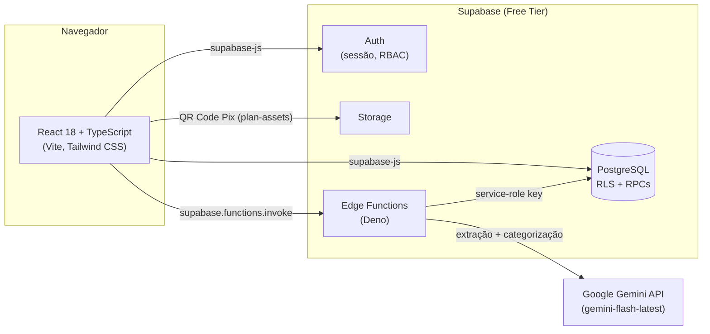

# 🏛️ Contabilidade Ministerial

**Gestão financeira, contábil e de governança (RBAC) para igrejas locais — com leitura automática de extratos bancários via IA.**

[](https://react.dev/)
[](https://www.typescriptlang.org/)
[](https://vitejs.dev/)
[](https://tailwindcss.com/)
[](https://supabase.com/)
[](https://ai.google.dev/)
[](https://saas-contabilidade-igrejas.vercel.app)
[](./LICENSE)

---

## 📖 Índice

- [Sobre o projeto](#-sobre-o-projeto)
- [Principais funcionalidades](#-principais-funcionalidades)
- [Arquitetura e stack técnica](#%EF%B8%8F-arquitetura-e-stack-técnica)
- [Estrutura de pastas](#-estrutura-de-pastas)
- [Pré-requisitos](#-pré-requisitos)
- [Instalação](#-instalação)
- [Como executar](#-como-executar)
- [Deploy](#-deploy)
- [Segurança e governança](#-segurança-e-governança)
- [Contribuição](#-contribuição)
- [Licença](#-licença)

---

## 📌 Sobre o projeto

O **Contabilidade Ministerial** é uma plataforma web para tesouraria de igrejas locais, construída em torno de três pilares: **simplicidade** de uso para tesoureiros não-técnicos, **auditabilidade total** de cada ação (nada é alterado ou excluído sem deixar rastro) e **automação via IA** para eliminar o trabalho manual de lançar extratos bancários linha a linha.

O diferencial da plataforma é a **leitura e categorização automática de extratos bancários (PDF/OFX/CSV)** via [Google Gemini](https://ai.google.dev/), que identifica entradas (dízimos, ofertas) e saídas (manutenção, ação social, contas) e sugere a categoria contábil antes de qualquer lançamento ser confirmado — sempre com revisão humana no meio do caminho.

> [!NOTE]
> Projeto em produção real, usado por uma igreja local. Todo o backend (banco de dados, autenticação, storage e as funções de IA) roda sobre o **free tier do Supabase**, sem custos de infraestrutura própria.

---

## ✨ Principais funcionalidades

| Módulo | Descrição |
|---|---|
| 🔐 **Autenticação & RBAC** | Login via Supabase Auth com 5 papéis (`master` + `Admin`, `Tesoureiro`, `Auditor`, `Conselho Fiscal` por igreja), reforçados a nível de banco (RLS + RPCs `SECURITY DEFINER`) — não só na interface. |
| 🏢 **Multi-tenant & Hierarquia de Igrejas** | Cada igreja é um tenant isolado por `church_id`, com suporte a hierarquia de 2 níveis (igreja matriz → igrejas filhas/subcongregações, autosserviço para o Admin da igreja mãe, limitado pelo plano de assinatura). O papel `master` (Admin Master da SaaS) gerencia todas as igrejas a partir do módulo de Governança, com visão global de usuários e seletor de "Igreja em Gestão". |
| 💳 **Planos de Assinatura & Pagamento Pix** | 3 planos (Gratuito/Profissional/Premium) com limites de leituras de IA, exportações de PDF, subcongregações, formatos de importação e Modo Estrito de categorização. Checkout manual via Pix (QR Code + chave + comprovante por WhatsApp) com aprovação do Admin Master; o próprio Master edita nome, preço, benefícios, limites e dados bancários/Pix de cada plano em um painel dedicado na Governança. |
| 📊 **Dashboard executivo** | KPIs de entradas/saídas com variação vs. período anterior, saldo em caixa, gráfico Entradas × Saídas e donut de saídas por categoria — tudo calculado a partir de lançamentos reais. |
| 📑 **Livro Caixa** | Extrato completo por mês/ano, saldo de abertura/fechamento calculado em runtime, lançamento manual (criar/editar/excluir) e exportação em CSV/Excel real + prévia de relatório em PDF/Word. |
| 🤖 **Importação inteligente com IA** | Upload de extrato (PDF, OFX, CSV ou imagem — formato liberado conforme o plano) processado pelo Gemini, que extrai e categoriza os lançamentos automaticamente; chat em linguagem natural para refinar a categorização antes de salvar; Modo Estrito com regras de categorização salvas por igreja; detecção de duplicatas contra o Livro Caixa. |
| 🔍 **Trilha de auditoria** | Log imutável (sem `DELETE`/`UPDATE` liberado) de todo acesso, criação, edição e exclusão de lançamentos — gerado automaticamente por *triggers* de banco, não por chamadas manuais do frontend. |
| 👥 **Gestão de usuários** | Cadastro com senha definida pelo Admin, troca de papel/status com confirmação extra para promoções/rebaixamentos de Admin, geração de link de redefinição de senha, bloqueio em tempo real de contas desativadas (via Realtime). |
| 📝 **Termos de Uso** | Aceite obrigatório e bloqueante no primeiro acesso de qualquer usuário, independente do papel, com registro do aceite no banco. |
| 🌗 **Tema claro/escuro** | Alternância persistente via Tailwind `dark` mode, sincronizada entre dispositivos (`profiles.theme`). |
| 📱 **Responsivo (mobile-first)** | Menu lateral em *drawer* no mobile, tabelas com scroll próprio, grids que colapsam por breakpoint — testado de 320px a desktop. |

---

## 🛠️ Arquitetura e stack técnica



| Camada | Tecnologia |
|---|---|
| **Frontend** | [React 18](https://react.dev/) + [TypeScript](https://www.typescriptlang.org/), [Vite 5](https://vitejs.dev/) |
| **Estilo/UI** | [Tailwind CSS 3](https://tailwindcss.com/) (dark mode via classe), [Lucide React](https://lucide.dev/) (ícones) |
| **Roteamento** | [React Router DOM 6](https://reactrouter.com/) |
| **Backend / Banco** | [Supabase](https://supabase.com/) — PostgreSQL, Row Level Security, RPCs `SECURITY DEFINER`, Realtime |
| **Autenticação** | Supabase Auth (e-mail/senha) |
| **Funções server-side** | Supabase Edge Functions (Deno) — `parse-statement`, `invite-user`, `generate-reset-link` |
| **Inteligência Artificial** | [Google Gemini API](https://ai.google.dev/) (alias `gemini-flash-latest`) — leitura multimodal nativa (PDF/imagem/texto) e categorização contábil via `responseSchema` estrito |
| **Hospedagem** | [Vercel](https://vercel.com/) (deploy automático a cada push em `main`) |

---

## 📂 Estrutura de pastas

```text
.
├── src/
│   ├── assets/            # SVGs e ilustrações estáticas
│   ├── components/        # Genéricos usados por 2+ páginas: Sidebar, Layout, Card, Badge,
│   │                      # Avatar, Toast, ProtectedRoute, TermsAcceptanceModal, ChurchFormFields,
│   │                      # PricingPlans/PricingModal/PixPaymentModal (cards de plano + checkout Pix)...
│   ├── context/           # AuthContext (sessão/RBAC) e AppContext (tema, toasts, dados globais)
│   ├── pages/             # Feature-driven: cada página com componentes exclusivos ganha sua
│   │                      # própria pasta (Página/Página.tsx + Página/components/)
│   │   ├── Dashboard/, Login/, ChurchDetails/, Governance/, StatementImport/,
│   │   │                  # Users/, PricingPlans/ — cada uma com sua components/
│   │   └── AuditLogs.tsx, CashBook.tsx, ResetPassword.tsx — sem subpasta (nada exclusivo)
│   ├── services/          # supabase.ts (client) e mockData.ts (helpers legados)
│   ├── types/             # Interfaces TypeScript (Transaction, Church, Plan, AuditLog...)
│   └── utils/             # Formatação de moeda/data, agregações de métricas, gráficos, plans.ts
│                          # (mapeamento único do plano de assinatura banco → front)
├── supabase/
│   ├── migrations/        # 0001_init.sql ... 0023_plan_management_and_bank_details.sql
│   │                      # (ver docs/database.md)
│   └── functions/
│       ├── _shared/       # Helper de CORS compartilhado entre as functions
│       ├── parse-statement/       # Extração + categorização de extratos via Gemini (multimodal)
│       ├── invite-user/           # Criação de usuário (Admin API)
│       └── generate-reset-link/   # Geração de link de redefinição de senha
├── legacy-static/         # Protótipo estático original (referência histórica)
├── docs/                  # Documentação modular (arquitetura, banco, RBAC, git workflow, changelog)
├── CLAUDE.md              # Diretrizes essenciais para o Claude Code (comandos, skills, índice)
└── vercel.json            # Rewrite de rotas para SPA
```

> Estrutura completa e detalhada em [`docs/architecture.md`](./docs/architecture.md).

---

## ✅ Pré-requisitos

- [Node.js](https://nodejs.org/) **18 ou superior** (e `npm`)
- Uma conta no [Supabase](https://supabase.com/) (free tier é suficiente)
- Uma chave de API do [Google AI Studio](https://aistudio.google.com/) (Gemini) para a importação com IA
- [Supabase CLI](https://supabase.com/docs/guides/cli) — apenas se for aplicar migrations/deploy de Edge Functions localmente

---

## 📦 Instalação

1. **Clone o repositório e instale as dependências:**

   ```bash
   git clone https://github.com/alessandrosaldanha/saas-contabilidade-igrejas.git
   cd saas-contabilidade-igrejas
   npm install
   ```

2. **Crie um projeto no Supabase** e rode as migrations, na ordem, em *SQL Editor* (ou via CLI):

   ```bash
   supabase link --project-ref <seu-project-ref>
   supabase db push
   ```

3. **Configure as variáveis de ambiente do frontend** — copie `.env.example` para `.env` e preencha com os dados do seu projeto (*Project Settings → API*):

   ```bash
   cp .env.example .env
   ```

   ```env
   VITE_SUPABASE_URL=https://xxxxxxxxxxxx.supabase.co
   VITE_SUPABASE_ANON_KEY=eyJhbGciOi...
   ```

4. **Configure os *secrets* das Edge Functions** (nunca no frontend):

   ```bash
   supabase secrets set GEMINI_API_KEY=<sua-chave-gemini>
   ```

   > [!IMPORTANT]
   > `SUPABASE_URL`, `SUPABASE_ANON_KEY` e `SUPABASE_SERVICE_ROLE_KEY` **não** precisam ser configuradas manualmente — o runtime de toda Edge Function do Supabase já as injeta automaticamente.

5. **Implante as Edge Functions:**

   ```bash
   supabase functions deploy parse-statement
   supabase functions deploy invite-user
   supabase functions deploy generate-reset-link
   ```

---

## ▶️ Como executar

| Comando | Descrição |
|---|---|
| `npm run dev` | Inicia o servidor de desenvolvimento (Vite) com hot-reload |
| `npm run build` | Type-check (`tsc -b`) + build de produção otimizado em `dist/` |
| `npm run preview` | Serve o build de produção localmente para validação |
| `npm run lint` | Roda o ESLint sobre todo o projeto |
| `npx tsc --noEmit` | Verificação de tipos isolada, sem gerar build |

> [!NOTE]
> O projeto ainda não possui uma suíte de testes automatizados (unitários/E2E). A validação de cada alteração é feita hoje via type-check, build e testes manuais/Playwright ad-hoc — ver histórico em [`docs/changelog.md`](./docs/changelog.md).

---

## 🚀 Deploy

- **Frontend:** publicado na [Vercel](https://saas-contabilidade-igrejas.vercel.app), com deploy automático a cada push na branch `main`. `vercel.json` faz o *rewrite* de todas as rotas para `index.html`, necessário para o roteamento client-side do React Router funcionar em qualquer URL.
- **Backend:** Supabase gerenciado (PostgreSQL + Auth + Edge Functions) — sem servidor próprio para manter.

---

## 🔒 Segurança e governança

- **RBAC reforçado no banco, não só na UI** — toda regra de permissão (quem pode ler/criar/editar/excluir) é uma *policy* de Row Level Security ou uma RPC `SECURITY DEFINER` no Postgres. Alterar `role` no cliente não concede nenhum acesso extra.
- **Trilha de auditoria imutável** — `audit_logs` não tem policy de `UPDATE`/`DELETE`; todo lançamento, edição de usuário e login gera um registro automático via *trigger* de banco, com IP e User-Agent reais da requisição.
- **Segredos nunca no frontend** — chaves sensíveis (`SUPABASE_SERVICE_ROLE_KEY`, `GEMINI_API_KEY`) só existem no runtime das Edge Functions; o cliente só recebe a `anon key`, pensada para ser pública.
- **CORS restrito por allow-list** — as Edge Functions respondem apenas às origens conhecidas (domínio de produção + `localhost` de desenvolvimento), em vez de aceitar qualquer site.
- **Política de senha** — mínimo de 8 caracteres, validado tanto no cliente quanto no servidor.
- **Bloqueio em tempo real** — desativar um usuário encerra a sessão dele imediatamente em qualquer aba/navegador aberto, via Supabase Realtime.
- **Sem segredos versionados** — `.env`/`.env.local` estão no `.gitignore` e nunca foram commitados; o repositório passou por auditoria de segurança completa (frontend, dependências, segredos e rotas) documentada em [`docs/changelog.md`](./docs/changelog.md).

---

## 🤝 Contribuição

Contribuições são bem-vindas. Para propor uma mudança:

1. Abra uma *issue* descrevendo o problema ou a melhoria antes de codar, quando possível.
2. Crie um branch a partir de `main`: `git checkout -b minha-feature`.
3. Garanta que `npx tsc --noEmit`, `npm run build` e `npm run lint` passam sem erros.
4. Abra um Pull Request descrevendo **o quê** e **o porquê** da mudança.

---

## 📄 Licença

Distribuído sob a licença **MIT**. Veja o arquivo [`LICENSE`](./LICENSE) para o texto completo.
